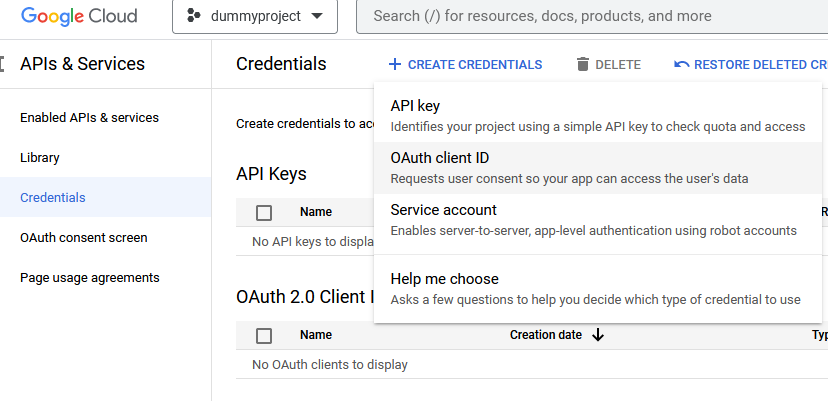

# Python_Google_photos

## Introduction
This repository will show the detailed process of extracting all mediaItems from google photos
using googlephotos API and store it on your local storage

## Setup
1. Install the libraries on your local machine as defined on the `requirement.txt` along with the version that is required for this project

```txt
google_api_python_client==1.12.8
google_auth_oauthlib==1.0.0
protobuf==3.20.3
requests==2.27.1
```

| Packages                     | official Documentation                                 |
|------------------------------|--------------------------------------------------------|
| google_api_python_client     | https://pypi.org/project/google_api_python_client/     |
| google_auth_oauthlib         | https://pypi.org/project/google_auth_oauthlib/         |
| protobuf                     | https://pypi.org/project/protobuf/                     |
| requests                     | https://pypi.org/project/requests/                     |

2. Once the first step is successfully done, next we need to get the **client_secret.json** file from google
   for this follow the step below
   - go to google console : https://console.cloud.google.com on your account
   - **step1** Follow my screenshots below step by step to create a project
   
     
     
     
    
     
     
     
    
   - **step2** Once project has been successfully created, configure consent screen
   
     
     
     
     
     
     
     
     
   - **step3** once you are in app information screen of "Oauth consent screen" you can just fill out App Name & user support email & developer contact email and leave everything as blank
   - **step4** once all set, you can now publish the app as below
     
     
     
    - you will be asked for push to production confirmation, please confirm
    - finally you can create Oauth Client_ID as below screenshot
    
      
      
    - you need to select "desktop app" as application name & create 
    - finally, you will be able to see your credentials "download json" and save it as "client_secret.json" file
    
      

3. Once you have the client_secret.json file, you can format your folder_structure based on the screenshot below
  
   

## Output

finally you can run now `python run google_photos.py` and your photos & videos will be extracted on the same folder